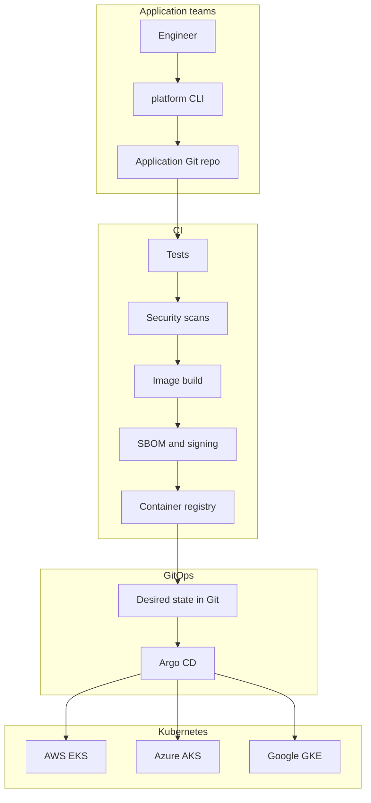
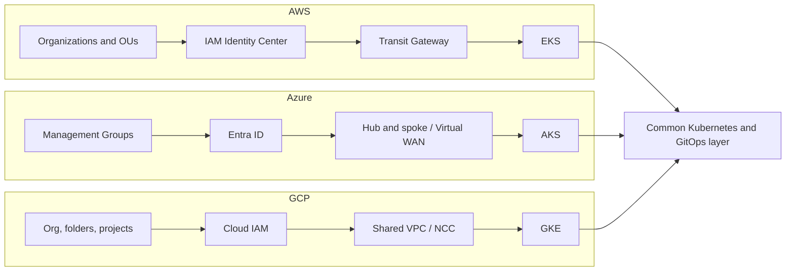

# Platform Engineering Reference Architecture

> A practical reference implementation for building and operating modern
> engineering platforms across AWS, Azure and Google Cloud.

This repository shows how a capable engineering organisation can give
application teams a consistent developer experience without pretending the
three cloud providers are the same product with different logos.

It covers cloud architecture, platform engineering, Kubernetes, networking,
security, reliability, observability, GitOps, developer experience, FinOps
and technical governance.

**Build capability, not dependency.** The platform provides golden paths for
the common case and explicit escape hatches for the rest. It does not attempt
to hide AWS, Azure and Google Cloud behind a lowest-common-denominator
abstraction.

This is a reference, not a product you apply blindly. Terraform, Kubernetes
and CI in this repository are real enough to format, validate, lint and test
without cloud credentials. They are not a click-to-production landing zone.

## What this is

A production-shaped foundation for a multi-cloud engineering platform:

* AWS Organizations-style landing zone concepts, implemented deepest
* First-class Azure and GCP architectures using native services
* A shared Kubernetes platform targeting EKS, AKS and GKE
* Argo CD GitOps from commit to cluster
* A small Go developer CLI (`platform create service`)
* A sample API used to prove the path, not to show off microservices
* Observability, FinOps, security scanning and a failure-lab

## What this is not

* A tutorial, certification lab or collection of toy Terraform examples
* A claim that multi-cloud is inherently desirable
* A wrapper that makes AWS, Azure and GCP look identical
* A reason to put everything on Kubernetes
* Production-ready for your organisation without adapting account structure,
  identity, networking and operational ownership

If a hiring manager reads this and concludes "this person has operated
platforms, and knows where they fail", the repository has done its job.

## Architecture overview



Cloud foundations sit underneath the clusters. They are not interchangeable.



The portability boundary is Kubernetes plus a common developer workflow. It
is not Terraform modules with the serial numbers filed off. See
[ADR-003](docs/decisions/003-kubernetes-abstraction-boundary.md) and
[ADR-004](docs/decisions/004-multi-cloud-strategy.md).

## Core principles

1. Prefer boring, proven technology over unnecessary novelty.
2. Automate repeatable work.
3. Make the secure path the easiest path.
4. Git is the source of truth for platform configuration.
5. Use short-lived credentials rather than permanent cloud access keys.
6. Infrastructure must be reproducible.
7. Platforms should reduce cognitive load for application teams.
8. Observability must be designed in rather than bolted on later.
9. Reliability is a measurable engineering property.
10. Cloud portability should exist at sensible abstraction boundaries.
11. Do not create a lowest-common-denominator multi-cloud platform.
12. Prefer provider-native capabilities where they materially improve the platform.
13. Architecture decisions should explicitly document trade-offs.
14. Cost is an architectural concern.
15. Golden paths should cover roughly 80% of normal engineering use cases,
    with explicit escape hatches for the rest.

Detail: [docs/principles](docs/principles/README.md).

## Supported cloud providers

| Provider | Depth in this commit | Native centre of gravity |
| --- | --- | --- |
| AWS | Landing zone concepts, VPC, TGW, EKS, security baseline, budgets | Organizations, IAM Identity Center, Transit Gateway |
| Azure | Architecture, hub-and-spoke / Virtual WAN, AKS skeleton | Management Groups, Entra ID, Azure Policy |
| GCP | Architecture, Shared VPC / NCC, GKE skeleton | Folders, projects, Shared VPC, Workload Identity |

AWS is the deepest implementation because that is how most enterprises
actually start. Azure and GCP are not afterthoughts. They use different
identity, networking and policy primitives on purpose.

## Developer workflow

```text
platform create service payments-api
git push
CI: test, scan, build, SBOM, sign
GitOps: Argo CD syncs Helm to EKS / AKS / GKE
```

The CLI currently scaffolds a Go service with Dockerfile, Helm chart,
GitHub Actions, ownership metadata, a default SLO and a runbook stub. It
does not provision cloud accounts. That remains a platform-team change.

## Platform capabilities

| Capability | Status |
| --- | --- |
| AWS landing zone architecture and Terraform foundations | Implemented |
| Azure and GCP equivalent architectures | Documented, Terraform skeletons |
| Shared Kubernetes base for EKS, AKS, GKE | Implemented |
| Argo CD bootstrap and application layout | Implemented |
| Sample Go API with metrics, traces, probes | Implemented |
| `platform` CLI (`version`, `doctor`, `create service`, `validate`) | Implemented |
| GitHub Actions CI without standing cloud keys | Implemented |
| Policy-as-code fixture proving scanners reject insecure IaC | Implemented |
| Failure-lab experiment framework | Implemented |
| FinOps tagging, budgets and cost models | Implemented |
| Full multi-account apply against live clouds | Not in this commit |
| Developer portal UI | Explicitly deferred, see ADR-009 |

## Repository structure

```text
docs/                  principles, ADRs, architecture, operating model
landing-zones/         AWS, Azure, GCP organisational design
terraform/             modules and compositions, one tree per provider
kubernetes/            base + provider overlays
gitops/                Argo CD bootstrap and environment apps
developer-platform/    CLI, golden paths, templates
examples/              sample-service and later consumers
security/              IAM, policy-as-code, supply chain, threat models
observability/         OpenTelemetry, Prometheus, Grafana, SLOs
resilience/            failure-lab, DR, game days
finops/                cost models, budgets, tagging
networking/            provider-native and multi-cloud notes
```

## Quick start

You do not need cloud credentials to validate this repository.

```bash
git clone <this-repo>
cd platform-engineering-reference
make init
make lint
make test
make validate
make security
```

Build the sample service and CLI:

```bash
make build
./bin/platform version
./bin/platform doctor
./bin/platform create service demo-api --dry-run
```

Plan infrastructure only with an explicit provider and environment:

```bash
make plan PROVIDER=aws ENVIRONMENT=dev
```

There is no default `make deploy`. Destruction requires both `PROVIDER` and
`ENVIRONMENT` and will refuse to run without them.

## Current implementation status

Honest status, not a badge board:

* **Ready to read and debate:** architecture, principles, ADRs, operating
  model, Northstar Rail migration case study.
* **Ready to validate locally:** Terraform fmt/validate, Go tests, Helm lint,
  policy fixtures, Makefile targets.
* **Not ready to apply to a live organisation:** account IDs, DNS, CIDRs,
  identity providers and connectivity must be designed for that estate.

## Roadmap

See [docs/ROADMAP.md](docs/ROADMAP.md). The next useful increment is a
repeatable AWS network hub plus one workload account that can run the sample
service under Argo CD, still without requiring this repository to hold
secrets.

## Design decisions

ADRs live in [docs/decisions](docs/decisions/README.md). Start with
Terraform (001), Argo CD (002), the Kubernetes boundary (003) and
multi-cloud strategy (004).

## Security

Security is a platform property, not a specialist add-on. CI rejects
insecure IaC fixtures on purpose. Read [SECURITY.md](SECURITY.md) and
[docs/security](docs/security/README.md).

## Contributing

See [CONTRIBUTING.md](CONTRIBUTING.md). Small, tested changes beat large
aspirational ones.

## Licence

Apache License 2.0. See [LICENSE](LICENSE).
