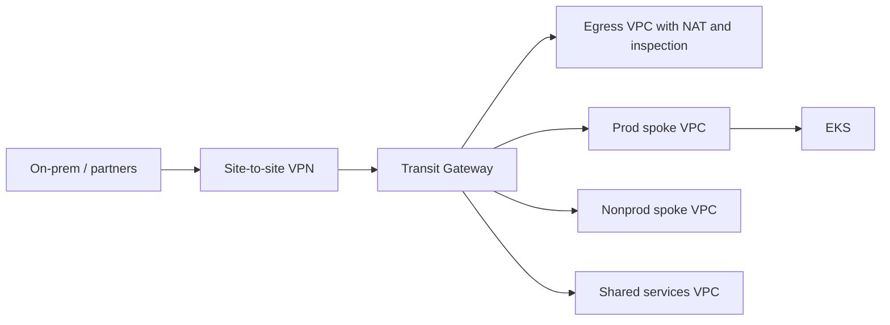

# AWS architecture

AWS is the deepest implementation in this reference. That is a starting
point, not a value judgement.

## Account model

Control Tower-style OUs, even if you build them with Organizations APIs
rather than the Control Tower product. The product is optional. The
isolation is not.

```text
Root
├── Security
│   ├── Log archive
│   └── Security tooling (GuardDuty org, Security Hub, Config aggregator)
├── Infrastructure
│   ├── Identity (IAM Identity Center delegated admin)
│   ├── Network (Transit Gateway, shared DNS, central egress)
│   └── Shared services
├── Workloads
│   ├── Prod
│   ├── Staging
│   └── Dev
└── Sandbox
```

Humans do not use long-lived access keys. IAM Identity Center maps groups
to permission sets. Workloads use IRSA.

## Network



* Private and public subnets per AZ. Public subnets exist for load
  balancers, not for workloads.
* NAT is centralised in the egress VPC for production. Local NAT in
  sandboxes is an allowed hatch.
* VPC endpoints for STS, ECR, S3, Logs, Secrets Manager, EKS APIs. This is
  a cost and reliability decision, not decoration.
* Route 53 private hosted zones associated to spokes via the network
  account.

Failure modes: a TGW route table change, a NAT exhaustion, a broken
resolver rule. All three look like "the app is down" to a developer.

## Security baseline

Every account gets:

* CloudTrail (organisation trail, integrity validation, log archive bucket)
* AWS Config (recorder + organisation aggregator)
* GuardDuty (organisation)
* Security Hub (CIS + FSBP)
* Default EBS and S3 encryption via KMS
* VPC flow logs

SCPs prevent leaving the organisation, disabling CloudTrail, and creating
IAM users with access keys in workload accounts.

## Compute

EKS is the golden path for the sample workload. It is not the golden path
for every AWS service. Lambda, ECS and managed data services remain valid.
Forcing them through Kubernetes is a religion, not a platform.

## Cost controls

* Mandatory tags: `Owner`, `Environment`, `CostCentre`, `Service`,
  `DataClassification`
* AWS Budgets per account and an org-level anomaly subscription
* NAT, AZ-crossing, and log ingestion called out in FinOps models

Terraform lives under `terraform/modules/aws` and `terraform/aws`.
Landing-zone narrative lives under `landing-zones/aws`.
