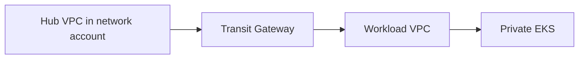

# AWS architecture

AWS is the deepest implementation in this reference. That is a starting
point, not a value judgement.

## Account model

Implemented in this slice: three accounts as variables, not an automated
Control Tower landing zone.

```text
Management account     (IDs supplied externally; optional SCPs)
    |
    +-- Network account    terraform/aws/network
    |
    +-- Workload account   terraform/aws/workload
```

The broader OU layout below is **planned**, not applied by this
repository:

```text
Root
├── Security            planned (log archive, security tooling)
├── Infrastructure
│   ├── Identity        planned (IAM Identity Center delegated admin)
│   ├── Network         implemented (TGW, hub VPC, private DNS zone)
│   └── Shared services planned
├── Workloads
│   └── One workload account implemented (dev/staging/prod via tfvars)
└── Sandbox             planned
```

Humans do not use long-lived access keys. GitHub uses OIDC. Application
pods use EKS Pod Identity. IRSA is the documented hatch.

## Network



Implemented: hub VPC, spoke VPC, TGW route tables, static routes for the
two CIDRs, flow logs, VPC endpoints, one NAT in the workload VPC so Argo
CD can reach GitHub.

Planned, not implemented: inspection VPC, Network Firewall, Direct
Connect, site-to-site VPN, centralised hub NAT, default routes via TGW.

Failure modes that would look like "the app is down": a TGW route table
change, NAT exhaustion, a broken resolver. The failure-lab covers pod,
bad rollout, NetworkPolicy and node drain. Packet-level TGW failover is
**not proved**.

## Security baseline

Optional in the workload stack (`enable_security_baseline`). When on:

* CloudTrail, Config, GuardDuty, Security Hub in that account
* Encrypted log bucket, no public access
* VPC flow logs

Organisation-wide trails, delegated admin and SCPs attached to OUs are
**planned**. `landing-zones/aws` can create deny-access-key and
deny-leave-org SCPs if you apply it in the management account.

## Compute

EKS is the golden path for the sample workload. Managed node groups,
private nodes, secrets encryption, control plane logs, add-ons
(CoreDNS, VPC CNI, kube-proxy, Pod Identity agent, metrics-server).
Karpenter is not in this slice.

## Status

| Piece | Status |
| --- | --- |
| Account variables and separate state | Implemented, validated locally |
| TGW routing in Terraform | Implemented, validated locally |
| EKS / ECR / OIDC / secrets | Implemented, validated locally |
| Argo CD bootstrap scripts and Git layout | Implemented, not live-proved here |
| Apply to a real AWS organisation | Not proved |

Terraform existing is not production-ready for your organisation.
