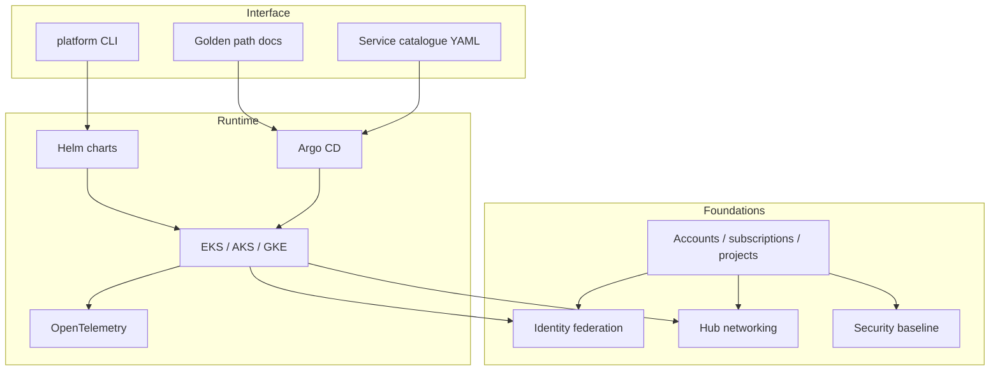

# Architecture overview

The platform has three layers. Mixing them is how you get a Terraform module
that tries to be a developer portal.

## Layer contracts

**Foundations** are provider-native. AWS Organizations, Azure Management
Groups and GCP folders are not abstracted. This layer is owned by the
platform team and changes slowly.

**Runtime** is the portability layer: Kubernetes, Helm, Argo CD,
OpenTelemetry, policy-as-code. Application teams deploy here. Provider
overlays exist for workload identity and storage classes.

**Interface** is how humans consume the platform: CLI, templates, catalogue,
docs, CI. A portal is optional (ADR-009).

## Environments

`dev`, `staging` and `prod` are the same composition with different
tfvars: account/subscription/project IDs, CIDRs, HA, deletion protection
and budget amounts. They are not three copies of the module tree.

| Environment | Purpose | HA | Public API |
| --- | --- | --- | --- |
| dev | Fast feedback, failure-lab | Single NAT / fewer AZs allowed | Optional |
| staging | Production-like, game days | Match prod topology | Internal |
| prod | User traffic | Multi-AZ, deletion protection | By design |

## What stays out of Kubernetes

* Identity stores (IAM Identity Center, Entra ID, Cloud Identity)
* Hub networks and hybrid connectivity
* Organisation policy and audit trails
* Data platforms that already have a better native home
* COTS that is not container-ready

Putting those in Kubernetes to "standardise" them moves operational risk
without removing it.

## Related

* [AWS](aws.md)
* [Azure](azure.md)
* [GCP](gcp.md)
* [Kubernetes](kubernetes.md)
* [Operating model](../operating-model/README.md)
