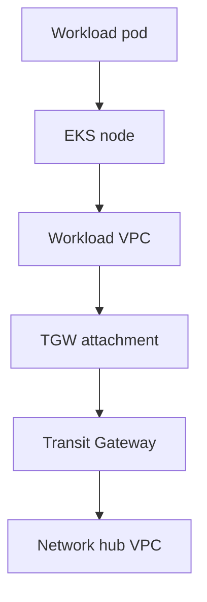

# AWS networking

Deliberately small. Hub VPC plus one workload VPC plus a Transit Gateway
that actually routes.

## What is implemented

* Hub VPC in the network account: private and TGW subnets, no NAT, no
  internet gateway, flow logs, a `logs` endpoint, a private hosted zone.
* Workload VPC: public subnets for load balancers later, private subnets
  for nodes, TGW subnets, VPC endpoints for AWS APIs, optional NAT so
  Argo CD can clone GitHub.
* Transit Gateway with default association and propagation disabled.
  Attachment auto-accept defaults to disable. Dev tfvars may enable it
  so a lab spoke can attach without a second network apply.
* Hub attachment associated to the hub route table.
* Spoke attachment associated to the spoke route table when
  `manage_tgw_routes` is true (same-account) or when the attachment ID is
  passed back into the network stack (cross-account).
* Static routes: hub CIDR on the spoke table, workload CIDR on the hub
  table. VPC route tables send only those CIDRs to the TGW.
* No `0.0.0.0/0` toward the TGW. That is asserted by
  `scripts/aws/assert-routes.sh` and Terraform tests.

## Traffic path

A pod sending packets to the hub CIDR:

1. The pod IP is on the node (VPC CNI).
2. The node routes from the private subnet route table.
3. Destination `network_hub_cidr` matches a TGW route, not NAT.
4. The TGW spoke table sends hub CIDR to the hub attachment.
5. The hub VPC receives the packet on the TGW subnet.

The reverse path uses the hub table and the workload CIDR.

This path is implemented in Terraform. Packet tests across the TGW are
not run in CI. Do not claim failover behaviour that has not been tested.

## What is not in this slice

These belong later. They are not missing by accident.

* Network Firewall, inspection VPCs, third-party firewalls
* Direct Connect or site-to-site VPN
* Centralised NAT in the hub and a default route on the spoke table
* Cross-account private hosted zone association for the workload VPC
* IPv6

To add hub egress later: NAT in the hub, `allow_default_route = true` on
the TGW module, and `allow_default_route_to_tgw = true` on the workload
VPC. That change is a routing incident waiting to happen. Treat it as a
change-controlled product, not a tfvars flip in passing.
